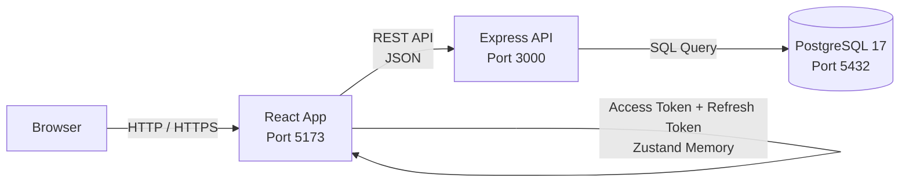
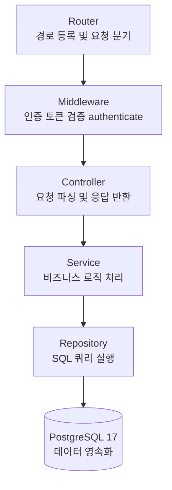
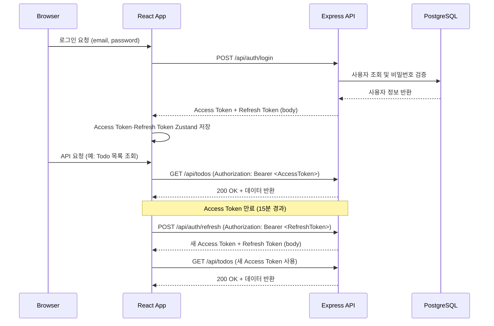
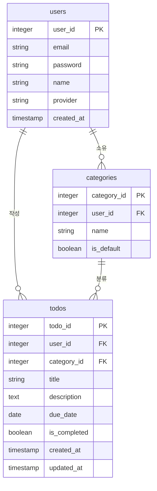

# TodoListApp 기술 아키텍처 다이어그램

| 항목 | 내용 |
|------|------|
| 버전 | v1.0 |
| 작성일 | 2026-05-13 |
| 참조 문서 | 1-domain-definition.md, 2-prd.md, 4-project-principles.md |

## 변경 이력

| 버전 | 날짜 | 내용 |
|------|------|------|
| v1.2 | 2026-05-13 | 인증 방식 변경: Refresh Token HttpOnly Cookie → Zustand 메모리 반영 |
| v1.1 | 2026-05-13 | 일관성 검토 반영: ERD PK/FK 타입 uuid→integer, 포트 번호 정합화(React 5173·Express 3000), PostgreSQL 버전 명시 |
| v1.0 | 2026-05-13 | 최초 작성 |

---

## 1. 시스템 컨텍스트

브라우저에서 React 앱을 통해 Express API 서버와 통신하고, API 서버가 PostgreSQL 데이터베이스에 접근하는 전체 흐름을 나타낸다.

---

## 2. 백엔드 레이어 구조

Router 에서 시작해 단방향으로 흐르는 레이어 구조이며, 각 레이어는 단일 책임을 가진다.

---

## 3. JWT 인증 흐름

로그인 시 Access Token(15분)과 Refresh Token(7일)을 모두 응답 바디로 전달하여 Zustand 메모리에 저장하고, Access Token 만료 시 Refresh Token으로 재발급하는 흐름을 나타낸다.

---

## 4. DB ERD

users, categories, todos 3개 테이블과 각 테이블 간 관계를 표현한다. categories 의 user_id 는 nullable 로, 기본 카테고리는 시스템 공용이다.

