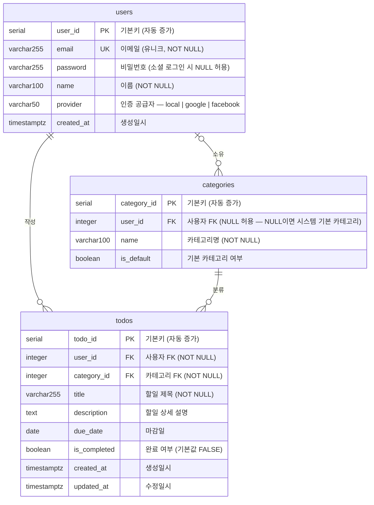

# TodoListApp ERD

| 항목 | 내용 |
|------|------|
| 버전 | v1.0 |
| 작성일 | 2026-05-13 |
| 참조 문서 | 1-domain-definition.md, 2-prd.md, 4-project-principles.md |

## 변경 이력

| 버전 | 날짜 | 작성자 | 변경 내용 |
|------|------|--------|----------|
| v1.0 | 2026-05-13 | Backend Developer | 최초 작성 — PRD DB 스키마 기준 ERD 정의 |

---

## ERD

PRD에 정의된 3개 테이블(`users`, `categories`, `todos`)의 구조와 관계를 나타낸다. `categories.user_id`는 NULL 허용으로 시스템 기본 카테고리(전체 사용자 공유)를 지원하고, `todos`는 반드시 사용자와 카테고리에 귀속된다.

> **관계선 읽는 법**
>
> | 기호 | 의미 |
> |------|------|
> | `\|\|` | 정확히 하나 (필수) |
> | `\|o` | 0 또는 하나 (선택) |
> | `o{` | 0개 이상 (선택) |
> | `\|{` | 1개 이상 (필수) |

---

## 엔티티 설명

| 테이블 | 역할 | 기본키 | 주요 제약 |
|--------|------|--------|----------|
| `users` | 인증된 서비스 사용자 정보를 저장한다. 소셜 로그인 사용자는 `password`가 NULL이며, `provider` 컬럼으로 인증 수단을 구분한다. | `user_id` (serial) | `email` UNIQUE NOT NULL, `name` NOT NULL, `provider` 기본값 `'local'` |
| `categories` | 할일을 분류하는 카테고리 정보를 저장한다. `user_id`가 NULL인 행은 모든 사용자가 공유하는 시스템 기본 카테고리다. | `category_id` (serial) | `user_id` NULL 허용, `name` NOT NULL, `is_default` 기본값 `FALSE` |
| `todos` | 사용자가 등록한 할일 항목을 저장한다. 반드시 특정 사용자와 카테고리에 귀속된다. | `todo_id` (serial) | `user_id` NOT NULL, `category_id` NOT NULL, `title` NOT NULL, `is_completed` 기본값 `FALSE` |

---

## 관계 설명

| 관계 | 표기 | 카디널리티 | 참조 무결성 | 비고 |
|------|------|-----------|------------|------|
| `users` → `todos` | 작성 | 1 : 0..N | ON DELETE CASCADE | 사용자 삭제 시 해당 사용자의 모든 할일 자동 삭제. `todos.user_id` NOT NULL이므로 할일은 반드시 사용자에 귀속 |
| `users` → `categories` | 소유 | 1 : 0..N | ON DELETE CASCADE | 사용자 삭제 시 해당 사용자의 카테고리 자동 삭제. `categories.user_id` NULL 허용이므로 시스템 기본 카테고리(NULL)는 어떤 사용자에도 귀속되지 않음 |
| `categories` → `todos` | 분류 | 1 : 1..N | RESTRICT (앱 레벨) | 할일이 존재하는 카테고리는 삭제 불가 (애플리케이션 레벨 검증). `todos.category_id` NOT NULL이므로 할일은 반드시 카테고리에 귀속 |
