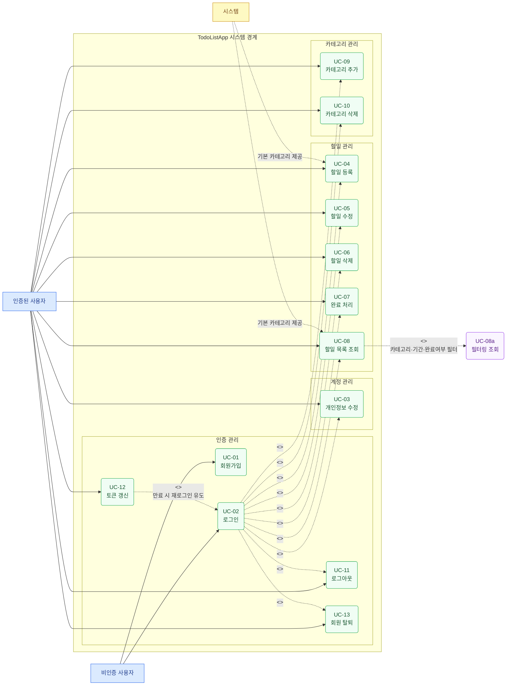

# TodoListApp 유스케이스 다이어그램

**버전:** 1.0  
**작성일:** 2026-05-13  
**참조 문서:** `2-prd.md`

---

---

## 액터 설명

| 액터 | 설명 |
|------|------|
| 비인증 사용자 | 로그인하지 않은 상태로 회원가입·로그인만 가능 |
| 인증된 사용자 | 로그인 후 모든 기능 사용 가능 |
| 시스템 | 기본 카테고리를 사전 제공하는 주체 |

## 관계 설명

| 관계 | 대상 | 내용 |
|------|------|------|
| `<<include>>` | UC-02 → UC-04~13 | 인증된 사용자 기능은 로그인(UC-02)을 전제로 한다 |
| `<<extend>>` | UC-08 → UC-08a | 할일 목록 조회는 필터링 조회로 확장될 수 있다 |
| `<<extend>>` | UC-12 → UC-02 | Refresh Token 만료 시 재로그인(UC-02)으로 분기된다 |

## 유스케이스 목록

| UC | 유스케이스명 | 액터 | 비고 |
|----|------------|------|------|
| UC-01 | 회원가입 | 비인증 사용자 | |
| UC-02 | 로그인 | 비인증 사용자 | |
| UC-03 | 개인정보 수정 | 인증된 사용자 | |
| UC-04 | 할일 등록 | 인증된 사용자 | 카테고리 필수 (BR-04) |
| UC-05 | 할일 수정 | 인증된 사용자 | |
| UC-06 | 할일 삭제 | 인증된 사용자 | |
| UC-07 | 완료 처리 | 인증된 사용자 | 토글 방식 (BR-07) |
| UC-08 | 할일 목록 조회 | 인증된 사용자 | 필터: category_id, from, to, is_completed |
| UC-08a | 필터링 조회 | 인증된 사용자 | UC-08 확장 |
| UC-09 | 카테고리 추가 | 인증된 사용자 | |
| UC-10 | 카테고리 삭제 | 인증된 사용자 | 기본 카테고리 수정·삭제 불가 (BR-05), 할일 존재 시 삭제 불가 (BR-08) |
| UC-11 | 로그아웃 | 인증된 사용자 | Refresh Token 무효화 |
| UC-12 | 토큰 갱신 | 인증된 사용자 | 만료 시 재로그인 유도 |
| UC-13 | 회원 탈퇴 | 인증된 사용자 | 데이터 즉시 삭제 |
